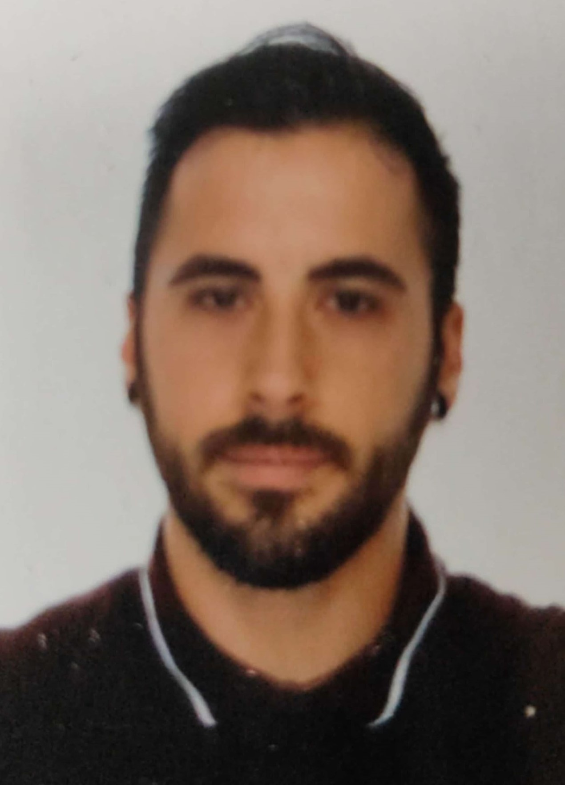

### ¡Hola a todos! 👋
# Yo soy Adrián Calvete

## IT Project Manager / Web App Developer 💬
En el sector IT desde hace 7 años, trabajando en distintos proyectos terminé como Project Manager en proyectos de software, en ese punto decidí reforzar mis conocmientos técnicos estudiando desarrollo web en la universidad, lo que conllevó en un aumento por mi interés en la parte técnica e inició una transición irreversible de la gestión del proyecto a la parte más técnica.

Como desarrollador tengo un pérfil junior con algo de experiencia en desarrollos web y de aplicaciones móviles y actualmente estudiando Desarrollo de aplicaciones web. Comprometido con el aprendizaje continuo y el crecmiento profesional

- 🌍 Madrid - Spain
- 🧠 Estudiantes DAW en Universidad Alfonso X
- 📫 Puedes contactar conmigo en: 

## Stack Tecnólogico

## Uso
Guía rápida sobre cómo utilizar el proyecto y ejemplos de código.

## Contribución 
Información sobre cómo contribuir al proyecto, directrices para enviar pull requests y reportar issues.

## Licencia
Licencia bajo la cual se distribuye el proyecto.

<!--
**AdrianCalveteDev/AdrianCalveteDev** is a ✨ _special_ ✨ repository because its `README.md` (this file) appears on your GitHub profile.

Here are some ideas to get you started:

- 🔭 I’m currently working on ...
- 🌱 I’m currently learning ...
- 👯 I’m looking to collaborate on ...
- 🤔 I’m looking for help with ...
- 💬 Ask me about ...
- 📫 How to reach me: ...
- 😄 Pronouns: ...
- ⚡ Fun fact: ...
-->
